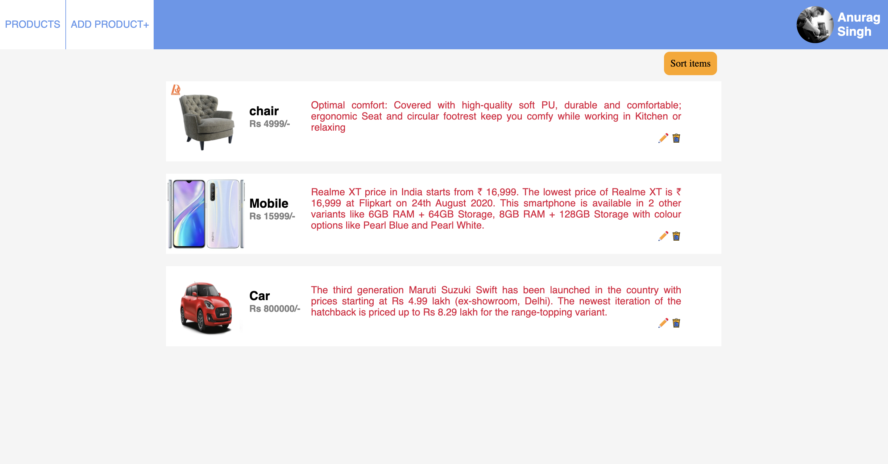

## Basic ecom flow made solely using react
### App contains basic functionalities like Adding a new product, editing the description on the product , Sorting the products according to price etc

## How to run this app on local system?
1) Clone the master-branch of this Git repo.  
2) Navigate to the folder and open terminal in it.  
3) Run command `npm install` - this will install the project on your local machine  
4) Run command `npm start` - this will open the browser and run the app  
5) In case you are stuck ? Ping me at anuragz[dot]v1[at]gmail[dot]com  

## What can this do ?
1) Edit product Description
2) Add new products 
3) Delete a product
4) Sort the products

## Screenshots

## THANKYOU <3
